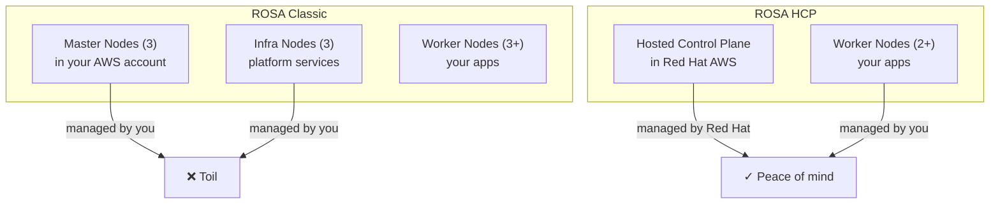

# ROSA Classic vs ROSA HCP

## The Case for Migration

Red Hat Managed Services · 2026

<!--
Speaker note: Welcome the ops/SRE teams. This talk is for teams running ROSA Classic in production. We know you've invested in Classic, we know migration feels risky—but HCP removes the operational burden you carry every day. By the end of this talk, you'll see the ROI clearly.
-->

---

# Running ROSA Classic: The Hidden Cost

A typical week for Classic ops: monitoring master/infra nodes in your AWS account, managing node capacity, responding to cost overages from running 9 always-on nodes. It works, but it demands constant attention.

**The question we're answering today:** Is there a better way?

**What you manage in Classic:**
- 3 master nodes (availability)
- 3 infra nodes (platform services)
- N worker nodes (your apps)

**What it costs you:**
- Infrastructure overhead
- Operational toil
- Limited feature velocity
- Uncertainty about the roadmap

<!--
Speaker note: Paint the picture of Classic ops life. This isn't a dig at Classic—it's been solid. But the burden is real. Transition: there's a better way, and you're ready for it.
-->

---
layout: section
class: section-header
---

# Section 1
## Cost Efficiency: 6 Fewer Instances

<!--
Section header: We're moving from problem to solution. First concrete advantage: money. This resonates immediately.
-->

---

# Infrastructure Cost Comparison

**The math is simple: fewer nodes, lower bills.**

**ROSA Classic (multi-AZ)**
- 3 master nodes (AWS-managed but in your account)
- 3 infra nodes (platform services)
- 3+ worker nodes (your apps)
- **Total: 9+ instances running 24/7**

**ROSA HCP (hosted control plane)**
- 0 master/infra nodes (in Red Hat's AWS account)
- 2+ worker nodes (your apps only)
- **Total: 2+ instances running 24/7**
- 6+ fewer EC2 instances in your account

Fewer instances = lower AWS spend every month. Multiplied across a multi-year migration horizon, this becomes substantial.

<!--
Speaker note: The core message: HCP eliminates the master/infra node overhead. Your account only pays for worker nodes. With a typical m5.xlarge baseline, that's 6 instances × $0.19/hour × 730 hours = ~$830/month per cluster. Across 5 clusters, $4,150/month. Over 3 years: $149,400. That's your ROI ceiling. Most real savings are higher because you're also eliminating the infra node overhead.
-->

---

# Cost Savings: Beyond the Instance Count

The 6 fewer instances are just the beginning.

**Additional savings from HCP:**

- No control plane scaling overhead (master nodes are finite)
- No master node patching cycles (Red Hat manages that)
- Reduced EBS volume costs (fewer persistent volumes needed)
- Simplified autoscaling (HCP respects your limits more cleanly)

**Secondary benefit:** Your team spends less time on cluster hygiene, freeing capacity for application work.

**Typical ROI timeline:** Cost savings offset migration effort in 6-12 months for a single production cluster. Multi-cluster environments see payback in 3-4 months.

<!--
Speaker note: Don't oversell—migration is real work. But the math is clear. And this is just the cost angle. The next section is about ops burden, which is often the bigger win.
-->

---
layout: section
class: section-header
---

# Section 2
## Infrastructure Simplification: No Master/Infra Nodes

<!--
Section header: We're moving from cost (financial) to ops burden (operational). This is where teams feel the real relief.
-->

---

# What Disappears in HCP

**ROSA HCP moves the control plane to Red Hat's managed AWS environment.** Your account only runs worker nodes. This eliminates an entire class of operational tasks.

**Tasks that vanish:**

- Monitoring master node health (CPU, disk, etcd latency)
- Patching master/infra nodes on a schedule
- Troubleshooting master node evictions or capacity issues
- Managing platform service replicas (ingress, logging, monitoring agents)
- Scaling the control plane if it hits limits

**What remains:**

- Worker node autoscaling (familiar, standard Kubernetes)
- Application health and deployment (your core work)

<!--
Speaker note: This is the human win. Ops teams hate being paged for control plane issues—they're invisible to the business but very visible to your on-call rotation. HCP removes that category entirely.
-->

---

# Simplified Node Architecture

What you manage shrinks by 67%: from 9+ nodes to 2+ nodes.

<!--
Speaker note: The diagram shows the shift. Classic: you manage everything. HCP: Red Hat owns the infrastructure layer, you own the application layer. That's the boundary you want.
-->

---
layout: section
class: section-header
---

# Section 3
## Faster Deployment & Autoscaling

<!--
Section header: We're building urgency now. Cost and ops are wins; speed is competitive advantage.
-->

---

# Deployment Speed: 4× Faster

**Provisioning a cluster is dramatically faster in HCP.**

**ROSA Classic**
- Create cluster API call
- AWS provisions 3 master + 3 infra + N worker nodes
- etcd initialization, cluster readiness checks
- Network configuration, security groups, IAM roles
- **Total: ~40 minutes**

**ROSA HCP**
- Create cluster API call
- Red Hat provision control plane (instant in your account)
- AWS provisions N worker nodes
- Network configuration, IAM roles
- **Total: ~10 minutes**

**Why this matters:** Faster cluster spin-up enables elasticity. Scale to zero for dev/test clusters. Rapid disaster recovery. On-demand compute provisioning without cluster lifecycle overhead.

<!--
Speaker note: Ops teams often don't think about cluster provisioning speed until they need it. Then it becomes critical for CI/CD (ephemeral test clusters), DR scenarios, or regional failover. HCP changes the game here.
-->

---

# Autoscaling Response: Cleaner and Faster

**HCP's separation of control plane from worker scaling means less contention.**

**ROSA Classic autoscaling pain points:**
- Control plane can become a bottleneck during rapid scale events
- Master node CPU spikes during cluster-wide scaling
- etcd write latency increases with node count
- You may need to pre-scale the control plane

**ROSA HCP autoscaling benefits:**
- Control plane resources scale independently (Red Hat handles it)
- Worker node scaling is a pure EC2 autoscaling event
- No master node contention during bursts
- Predictable, linear scaling response

<!--
Speaker note: For teams running high-traffic or bursty workloads, this is a game-changer. Classic ops teams often work around control plane limits by pre-scaling or manually adding master node capacity. HCP removes that entirely.
-->

---
layout: section
class: section-header
---

# Section 4
## Improved Security & Compliance

<!--
Section header: We're building confidence now. HCP isn't just cheaper and faster—it's more secure.
-->

---

# Network Isolation: PrivateLink

**ROSA HCP uses AWS PrivateLink to isolate the control plane from your data plane.**

**ROSA Classic**
- Control plane and worker nodes in the same VPC
- Master nodes accessible via security groups (same blast radius)
- Network policies apply uniformly
- If compromised, attacker can reach master nodes

**ROSA HCP**
- Control plane in Red Hat's VPC
- Worker nodes in your VPC
- Connected only via AWS PrivateLink endpoint
- Attacker reaching your VPC cannot directly access control plane
- Stronger isolation boundary

**Compliance win:** Reduces attack surface for compliance audits (SOC 2, FedRAMP, etc.). You can enforce stricter network policies on your worker nodes without affecting the control plane.

<!--
Speaker note: This is a subtle but critical security improvement. It's not that Classic is insecure—it's that HCP gives you a stronger isolation boundary. For teams with compliance requirements, this matters.
-->

---

# Audit & Compliance Capabilities

**ROSA HCP provides better auditability of control plane activities.**

**Available in HCP:**
- Red Hat-managed audit logs for API server activity
- CloudTrail integration for control plane API calls
- Encrypted etcd storage (managed by Red Hat)
- Automated backup and recovery procedures
- Compliance-ready logging for SOC 2, PCI-DSS, FedRAMP

**Operational benefit:**
- Your security and audit teams get production-grade visibility
- No need to manage etcd backups or cluster recovery procedures
- Audit trail is immutable and centralized

<!--
Speaker note: For enterprise teams, audit is non-negotiable. HCP bakes it in. Classic teams often have to layer on external monitoring to satisfy audit requirements.
-->

---
layout: section
class: section-header
---

# Section 5
## Roadmap Advantage: The Future is HCP

<!--
Section header: We're building urgency and motivation now. This is about momentum and what comes next.
-->

---

# Classic is on the Sunset Path

**New features in ROSA are HCP-first. Classic is receiving maintenance, not innovation.**

**Features coming to HCP (Q2-Q3 2026 and beyond):**

- **Autonode** - Automatically right-size nodes based on workload requirements (Q2 2026)
- **Scale-to-zero** - Elasticity for infrastructure cost savings (Q3 2026)
- **Enhanced disaster recovery** - Automated, zero-RTO failover
- **Advanced observability** - Integrated metrics and tracing
- **Next-gen security features** - Network policies, pod security

**Classic status:**
- Bug fixes and security patches only
- No new features planned
- Sunset date: TBD, but announced deprecation path

**Strategic message:** Staying on Classic means staying behind. HCP is where innovation happens.

<!--
Speaker note: This is about momentum. Your team will be learning new features on HCP while Classic teams are maintaining the status quo. Over a 3-year horizon, that feature gap becomes significant.
-->

---

# Why the Roadmap Shift?

**HCP is architecturally simpler and more efficient for Red Hat to operate.** This enables faster iteration.

**From Red Hat's perspective:**

- Hosting control planes is capital-efficient (many customers, one managed infrastructure)
- Bug fixes and feature releases don't require coordinating with customer account updates
- Telemetry and observability are built-in (better reliability)
- Quality assurance is easier (all clusters are on the same code version)

**From your perspective:**

- You get features faster (no deployment lag)
- Clusters are more reliable (Red Hat's managed infrastructure is battle-tested across thousands of deployments)
- Your team isn't managing the control plane, so they can focus on your roadmap

<!--
Speaker note: This isn't just marketing—it's structural. HCP is genuinely simpler for Red Hat to operate, which means faster iteration for you.
-->

---

# Next Steps: Migration Planning

**You're convinced. What now?**

**This is a conversation, not a decision.**

1. **Schedule an architecture review** with Red Hat
   - Discuss your cluster topology (single, multi, regional)
   - Understand workload migration patterns (can you do rolling, or do you need blue-green?)
   - Clarify timing and dependencies

2. **Build a migration runbook** together
   - Data migration strategy
   - DNS and network cutover plan
   - Rollback procedures
   - Team training and runbooks

3. **Start with a non-prod cluster** (if possible)
   - Validate your migration process in a lower-risk environment
   - Your ops team learns the HCP patterns before touching production

<!--
Speaker note: We're not asking you to migrate tomorrow. We're asking you to start the conversation. Most teams find that once they understand HCP, the ROI case is clear. But do it on your timeline.
-->

---

# Closing: The Case is Clear

**HCP is cheaper, simpler, faster, more secure, and the future is there.** The migration effort is real, but the gains compound.

**You came in asking:** "Is HCP worth the hassle?"

**You leave knowing:** "Classic's operational burden costs us money every day. HCP removes it in 6 months."

**Next action:** Reach out to your Red Hat account team to schedule an architecture review. Let's build the runbook together.

<!--
Speaker note: End with confidence. You've made the case clearly. The audience should leave feeling: (1) we see the value, (2) we know what the first step is, (3) Red Hat has our back for the migration. If there's Q&A, be ready to dig into: specific cost numbers (they'll want your instance type and region), workload migration patterns (stateful vs stateless, databases), and timeline constraints (when do you need to be off Classic?).
-->

---

# Questions?

**Slide deck:** This presentation and the design doc are in the mobb-deck-template repo.

**Follow-up:** We'll send a migration planning workbook via email. Start there.

Red Hat Managed Services · ROSA Documentation · https://docs.openshift.com/rosa/

<!--
Speaker note: Leave space for questions. The real value often comes in Q&A—teams will ask about their specific constraints, and you'll get concrete feedback on what blocks them.
-->
