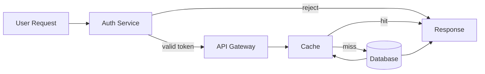
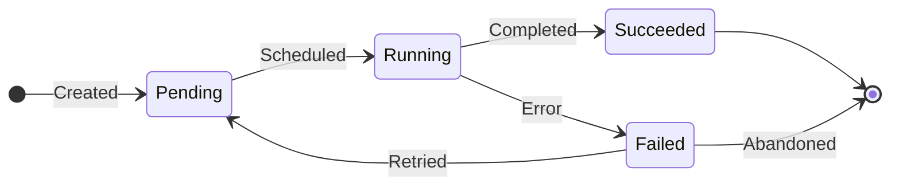

<!-- SLIDE 1  -  AI disclaimer
  Always the first slide. Brief, honest, non-alarmist.
  Keep it one paragraph — the audience should be able to read it in 10 seconds.
  Centered via flex wrapper (Slidev does not support per-slide frontmatter on slide 1). -->

<div class="h-full flex flex-col items-center justify-center text-center">

# A Note on This Presentation

<div class="mt-6 max-w-2xl mx-auto text-[var(--rh-muted)] leading-relaxed">

This presentation was created with the assistance of AI. While the visuals are polished and the structure is sound, the content may contain inaccuracies. Please verify any technical claims, pricing figures, or roadmap dates before relying on them.

</div>

<div class="mt-8 text-xs text-[var(--rh-muted)] italic">

AI-assisted · verify before you trust

</div>

</div>

---

<!-- ============================================================
  SLIDE 2  -  Title slide (was SLIDE 1)
  The opening card. One strong headline, optional subtitle,
  and a byline. Keep it sparse  -  the slide reads fast in a dark room.
============================================================ -->

# Your Presentation Title Here

## A compelling one-line subtitle that frames the talk

<div class="mt-8 text-[var(--rh-muted)]">
Your Name · Your Role · Organisation · Year
</div>

<!--
Speaker note: Welcome the audience, introduce yourself briefly.
State the core thesis of the talk in one sentence.
Brand rule: title ≤2 lines (official Red Hat standard). If it runs long, cut — move context to the subtitle.
-->

---

<!-- ============================================================
  SLIDE 2  -  Speaker intro (bio + avatar grid)
  Use cols-2 for a multi-speaker or human-vs-AI style intro.
  Replace /speaker.png with your image in public/.
  Use the robot emoji placeholder when no headshot is available.
============================================================ -->

# Meet the Speaker(s)

<div class="cols-2 mt-2 gap-6 text-sm leading-snug [&_h3]:!text-xl [&_h3]:!mt-0 [&_h3]:!mb-1">
<div class="flex flex-col items-center text-center">


### Paul Czarkowski
<div class="rh-tag mb-2">Human</div>

Senior Principal Cloud Specialist · Red Hat

Replace this bio with your own  -  what you work on, why you're giving this talk.

<div class="mt-1.5 text-[var(--rh-muted)] text-xs">

[website.example.com](https://example.com) · [github.com/handle](https://github.com)

</div>
</div>
<div class="flex flex-col items-center text-center">

<div class="w-28 h-28 shrink-0 rounded-full mb-2 border-2 border-[var(--rh-blue)] flex items-center justify-center text-4xl" style="background: var(--rh-surface)">🤖</div>

### Co-Presenter / Tool
<div class="rh-tag mb-2" style="background: var(--rh-blue)">AI</div>

Optional second column  -  remove this `<div>` block for a solo talk.

Great for framing a tool, a team-mate, or a system as a co-presenter.

<div class="mt-1.5 text-[var(--rh-muted)] text-xs">

[tool.example.com](https://example.com)

</div>
</div>
</div>

<!--
Keep intros short  -  60 seconds max. Use the second column for a tool,
an AI, or a co-presenter. Remove it entirely for a solo talk by deleting
the second <div class="flex flex-col..."> block and the enclosing cols-2 div.
Brand rule: speaker photo is optional — the red circle border alone is sufficient if no headshot is available.
-->

---

<!-- ============================================================
  SLIDE 3  -  Agenda / talk overview (two-column outline)
  Left: key stats or hook. Right: numbered agenda list.
  Use cols-2 directly in Markdown  -  no custom component needed.
============================================================ -->

# This Talk

<div class="cols-2">
<div>

**A hook statement  -  a number, a problem, a tension.**

One or two sentences that set the stakes. Why should the audience care right now? What will they leave with?

</div>
<div>

**What we'll cover:**

1. Context and background
2. The core problem
3. How we approached it
4. The key findings
5. Patterns to take home

</div>
</div>

<!--
Use the left column for the "why this matters" and the right for the agenda.
Keep agenda items short  -  they'll reappear as section headers.
Brand rule: agenda lists max 5-6 items per column. Split into two columns (cols-2) if the talk has more than 6 sections.
-->

---
layout: section
class: section-header
---

<!-- ============================================================
  SLIDE 4  -  Section header
  Marks the start of a major section. layout: section + class:
  section-header together render the h1 in large red type with
  no left-border accent. The h2 is the section subtitle.
============================================================ -->

# Section 1
## Context and Background

<!--
Section headers give the audience a landmark. Keep the h1 to a section
number or short label; use h2 for the full title so it can wrap naturally.
Brand rule: divider text ≤3 lines. Optional: add supporting copy to a right column using cols-2.
-->

---

<!-- ============================================================
  SLIDE 5  -  Two-column comparison (RhTwoColumn component)
  Best for contrast: before/after, option A vs B, human vs AI.
  Uses named slots #left and #right. Put Mermaid diagrams OUTSIDE
  this component  -  they won't render inside slots.
============================================================ -->

# Two-Column Comparison

<RhTwoColumn>
  <template #left>

  ### Option A (or: Before)
  - First point about option A
  - Second point  -  keep bullets tight
  - Third point  -  one idea per bullet

  </template>
  <template #right>

  ### Option B (or: After)
  - First point about option B
  - Second point
  - Third point

  </template>
</RhTwoColumn>

> *A memorable one-line takeaway that names the winner or frames the trade-off.*

<!--
RhTwoColumn is a thin wrapper around the .cols-2 grid utility.
Tip: Use ### headings inside the slots to label each column clearly.
The blockquote accent at the bottom anchors the takeaway message.
Brand rule: slide title ≤1 line on content slides. If you need more context, put it in the ### headings or the blockquote, not the h1.
-->

---

<!-- ============================================================
  SLIDE 6  -  Bullet list (standard content slide)
  The workhorse format. One strong headline, 3-5 bullets,
  optional blockquote for emphasis. Avoid sub-bullets where possible.
============================================================ -->

# Key Findings

- **Bold label for first point**  -  supporting detail in regular weight
- **Second finding**  -  brief explanation; one clause is enough
- **Third finding**  -  if you need more detail, add a second sentence here
- **Fourth finding**  -  keep the list to 4-5 items max; split the slide otherwise

<div class="mt-6 text-[var(--rh-muted)] text-sm">

Optional callout paragraph in muted text  -  good for caveats, context, or attribution.

</div>

> *Blockquote for the single most important idea on this slide.*

<!--
This is the safest layout. When in doubt, use it.
Rule of thumb: if the bullets need sub-bullets, split into two slides.
Brand rule: title ≤1 line. Keep bullets to 4-5 items max — beyond that, split the slide.
If any claim comes from external research, add a source line at the bottom: `Source: Name, Year`.
-->

---

<!-- ============================================================
  SLIDE 7  -  Code block (syntax-highlighted)
  Shiki handles highlighting automatically. Wrap long lines.
  For before/after code comparisons, use two fenced blocks with
  ### headings between them  -  see the pattern below.
============================================================ -->

# Code Example

### The problem

```python
# Fragile: direct string formatting, no validation
def connect(host, port):
    url = "http://" + host + ":" + str(port)
    return requests.get(url)
```

### The fix

```python
# Robust: validated URL construction with timeout
from urllib.parse import urlunparse

def connect(host: str, port: int, timeout: int = 10):
    url = urlunparse(("http", f"{host}:{port}", "/", "", "", ""))
    return requests.get(url, timeout=timeout)
```

> *The fix is one function change. The headline is why it matters.*

<!--
Use ### headings to label before/after blocks. Keep code excerpts short  -  
if the block scrolls, split the slide or extract the key lines.
lineNumbers: false is set globally; enable per-block with {lines:true} in the fence.
Brand rule: code slides rarely need a source, but do credit external snippets with a muted caption below the block.
-->

---

<!-- ============================================================
  SLIDE 8  -  Table (RhTable component)
  Props-driven: pass headers as a string array and rows as a 2D array.
  All cell content is plain text  -  no HTML inside cells.
  For rich cell content (badges, links), use a custom component.
============================================================ -->

# Comparison Table

<RhTable
  :headers="['Dimension', 'Approach A', 'Approach B', 'Notes']"
  :rows="[
    ['Setup time',    'Minutes',  'Hours',    'A uses defaults; B is fully custom'],
    ['Flexibility',   'Low',      'High',     'B supports all edge cases'],
    ['Operational complexity', 'Low', 'Medium', 'B requires ongoing tuning'],
    ['Recommended for', 'Teams starting out', 'Production at scale', ''],
  ]"
/>

<div class="mt-4 text-sm text-[var(--rh-muted)]">

Add a sentence below the table to draw the reader's eye to the most important row or column.

</div>

<div class="mt-2 text-xs text-[var(--rh-muted)]">

Source: Your Source, Year

</div>

<!--
RhTable renders a full-width responsive table with RH styling.
Keep tables to 4 columns or fewer  -  they compress badly at slide scale.
For wider data, consider splitting into two tables or using a bullet list.
Brand rule: always include a source line on data slides. Delete it only if the data is self-generated or obvious.
-->

---

<!-- ============================================================
  SLIDE 9  -  Mermaid flowchart
  Mermaid blocks MUST sit in plain slide Markdown  -  not inside
  Vue component slots. Use flowchart LR for left-to-right flows,
  TD for top-down. Avoid inline styles (fill:#, color:)  -  they
  break in dark mode. Use style statements instead if needed.
============================================================ -->

# System Flow



<!--
flowchart LR keeps wide diagrams readable. Use node IDs without spaces
(camelCase or underscores). Quote edge labels that contain special chars:
  A -->|"O(1) lookup"| B   ← correct
  A -->|O(1) lookup| B     ← breaks (parens parsed as node syntax)
Brand rule: diagram slides benefit from a muted source or attribution line if the architecture is from an external reference.
-->

---

<!-- ============================================================
  SLIDE 10  -  Mermaid state diagram (lifecycle / process flow)
  stateDiagram-v2 with direction LR keeps it compact.
  Good for showing how something moves through states over time.
============================================================ -->

# State / Lifecycle Diagram



<div class="mt-4 text-sm text-[var(--rh-muted)]">

Add a sentence explaining what triggers the key transitions in your system.

</div>

<!--
stateDiagram-v2 is ideal for CRD reconciliation loops, CI pipelines,
request lifecycles, or any process with defined states.
Keep to 6-8 states  -  beyond that, split or use a flowchart.
-->

---

<!-- ============================================================
  SLIDE 11  -  Image slide (full-height image with caption)
  Put images in public/  -  they're served at /filename.png.
  The .rh-image-slide wrapper + flex layout fills the available
  height below the title and caption without overflowing.
  Remove the <p> caption if you want the image to fill more space.
============================================================ -->

# Architecture Diagram

<div class="rh-image-slide">

A brief caption explaining what the diagram shows and what to focus on.

<div class="rh-image-slide__figure">

</div>

</div>

<!--
Always write a meaningful alt attribute  -  it doubles as context for AI agents
reading the slide source without rendering the image.
For diagrams that change frequently, consider Mermaid instead of a PNG so
source diffs are readable and the image never goes stale.
-->

---
layout: center
class: text-center
---

<!-- SLIDE 12  -  Quote / stat callout
  layout: center + class: text-center centres everything.
  Good for a big moment: a key finding, a memorable quote, a stat
  that reframes the conversation. -->

# The Number That Changes Everything

<div class="text-6xl font-bold mt-6" style="color: var(--rh-red); font-family: 'Red Hat Display', sans-serif">
42%
</div>

<div class="text-2xl mt-4 text-[var(--rh-muted)]">
of teams that adopt X see Y within 90 days
</div>

<div class="mt-8 text-sm text-[var(--rh-muted)]">
Source: Your Citation, Year
</div>

<!--
Use this format sparingly  -  one per major section at most.
The number or quote should be the single most important data point on this slide. Everything else is context.
Brand rule: always cite the source. If you can't name the source, don't use the stat.
-->

---

<!-- ============================================================
  SLIDE 13  -  Spectrum / maturity scale (RhSpectrum component)
  Shows a progression from basic to advanced, highlighting
  where your subject sits. Stages with active: true are red.
  leftLabel and rightLabel label the ends of the scale.
============================================================ -->

# Where Does This Fit?

<RhSpectrum
  :stages="[
    { label: 'Manual\nProcess',      icon: '🖐️' },
    { label: 'Scripted\nAutomation', icon: '📜' },
    { label: 'CI/CD\nPipeline',      icon: '⚙️' },
    { label: 'Self-Healing\nSystem',  icon: '🔄', active: true },
  ]"
  left-label="← ad-hoc"
  right-label="production-ready →"
/>

<div class="mt-6 text-[var(--rh-muted)] text-sm">

This talk is about reaching the highlighted position  -  and what it takes to get there reliably.

</div>

<!--
RhSpectrum is good for framing ambition or positioning your technology
on a maturity curve. Keep to 4-5 stages  -  beyond that the labels compress.
The active stage draws the eye without needing a pointer.
-->

---

<!-- ============================================================
  SLIDE 14  -  Timeline (RhTimeline component)
  Horizontal milestone timeline. Each milestone has a date,
  label (supports \n for line breaks), and optional color.
  The legend prop adds a colour key below the timeline.
============================================================ -->

# Project Timeline

<RhTimeline
  :milestones="[
    { date: 'Week 1',  label: 'Discovery\n& scoping',    color: '#73BCF7' },
    { date: 'Week 3',  label: 'First\nprototype',        color: '#73BCF7' },
    { date: 'Week 5',  label: 'Stakeholder\nreview',     color: '#F0AB00' },
    { date: 'Week 7',  label: 'Iteration\n& testing',    color: '#F0AB00' },
    { date: 'Week 10', label: 'Production\nlaunch',      color: '#5BA352' },
  ]"
  :legend="[
    { color: '#73BCF7', label: 'Build' },
    { color: '#F0AB00', label: 'Review' },
    { color: '#5BA352', label: 'Ship' },
  ]"
/>

<div class="mt-4 text-sm text-[var(--rh-muted)]">

Add a sentence noting any surprises, pivots, or lessons from the timeline.

</div>

<!--
RhTimeline takes milestones and an optional legend. Colors are free-form
CSS color strings  -  use the RH palette variables where possible:
  #73BCF7 = --rh-blue, #EE0000 = --rh-red, #5BA352 = --rh-green,
  #F0AB00 = --rh-yellow
-->

---
layout: center
class: text-center
---

<!-- SLIDE 15  -  Closing / CTA
  layout: center + class: text-center for a centred layout.
  The large headline is the single message you want the audience
  to leave with. Links go below in muted text. -->

# Your Closing Line Here.

<div class="text-3xl font-bold mt-4" style="color: var(--rh-red); font-family: 'Red Hat Display', sans-serif">
A bold, memorable second line  - <br />the thing you want people to repeat.
</div>

<div class="mt-12 text-sm" style="color: var(--rh-muted)">

[github.com/your-org/your-repo](https://github.com) ·
[your-website.example.com](https://example.com) ·
[your-handle@social.example](https://example.com)

</div>

<div class="mt-6 text-xs italic" style="color: var(--rh-muted)">

*An optional light closer  -  a callback to a joke from earlier, a thank-you, or a next step.*

</div>

<!--
The closing slide should leave one idea ringing in the audience's ears.
The red subheadline is the most prominent visual element  -  make it count.
Links give people something to do after the talk; keep to 2-3.
-->

---

<!-- SLIDE 16  -  Reactive phase animation (Pattern B)
  Use a self-contained Vue component to animate a multi-state diagram.
  The component loops automatically and lets the presenter pause on any
  state by clicking the phase dot  -  no Slidev click progressions needed.

  When to use this pattern:
    - You have a before/during/after story (steady state → event → recovery)
    - The diagram has 3–6 distinct states that each deserve explanation
    - You want the slide to be live during Q&A, not frozen on one frame

  See AGENTS.md → "Animated components → Pattern B" for the full guide.
  The reference implementation is components/PhaseAnimation.vue. -->

# How Balloon Pods Work

<div class="text-sm text-[var(--rh-muted)] text-center mb-4">

Low-priority **pause Pods** reserve capacity ahead of bursts  -  the scheduler preempts them
instantly when real workloads arrive, bridging **seconds-scale HPA decisions** and
**minute-scale node provisioning**.

</div>

<PhaseAnimation />

<!--
Speaker note: Walk through each phase using the dot controls  -  click a dot to jump to
that state and pause, then explain it before resuming. The animation loops automatically
when not paused, so it's self-running while the audience reads around it.

Phase 1 (At Rest): balloons hold warm slots, zero CPU consumed.
Phase 2 (Spike): scheduler evicts balloons in < 1 second  -  users see no interruption.
Phase 3 (Provisioning): autoscaler restores headroom in the background (5–7 min).
Phase 4 (Restored): back to steady state, ready for the next spike.
-->
