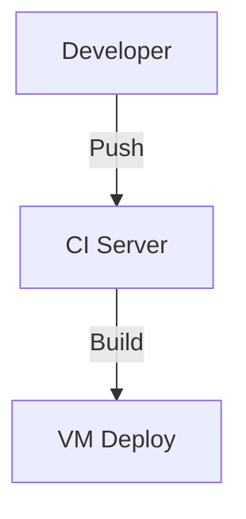
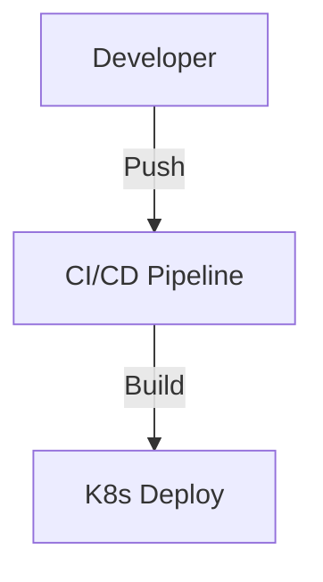
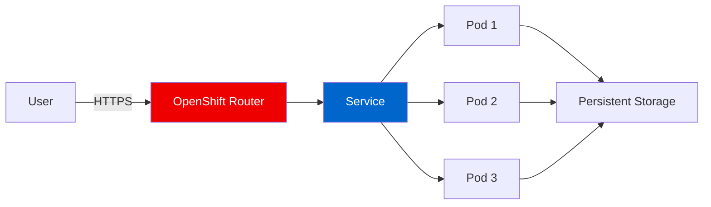

# Slidev Theme Red Hat
## Modern Presentations for Cloud-Native Teams

A Slidev theme implementing Red Hat brand standards for technical presentations, conference talks, and developer education.

---
layout: intro
image: https://via.placeholder.com/200
---

# Paul Czarkowski
## Principal Solutions Architect

Red Hat Managed OpenShift Black Belt

- 15+ years in cloud infrastructure
- Open source contributor and community advocate
- Focus: Kubernetes, OpenShift, ROSA, ARO

---
layout: default
---

# Typography & Content

The theme uses **Red Hat Display** for headings and **Red Hat Text** for body content, following official brand guidelines.

## Key Features

### Design Elements
- Clean, professional layouts
- Accessible color contrast
- Dark mode support

### Technical Capabilities
- Syntax highlighting for code
- Mermaid diagram support
- Interactive components

**Bold text** for emphasis, *italic* for subtle stress, and [hyperlinks](https://redhat.com) in brand red.

---
layout: two-cols
---

# Side-by-Side Comparison

## Self-Managed OpenShift

- Full control over infrastructure
- Custom configurations
- On-premises or cloud
- Requires dedicated ops team
- Manual upgrades and patches

::right::

## Managed OpenShift (ROSA)

- AWS-native managed service
- Red Hat SRE team included
- 99.95% SLA guarantee
- Automated updates
- Pay-as-you-go pricing

---
layout: two-cols-header
---

# Development Workflow Architecture

::left::

### Traditional VM-Based



Manual scaling, slow deployments

::right::

### Cloud-Native Kubernetes



Declarative, automated, scalable

---
layout: section
---

# Code Examples
## Demonstrating Syntax Highlighting

---
layout: default
---

# Kubernetes Deployment

Here's how to deploy a simple application on OpenShift or Kubernetes:

```typescript {maxHeight:'320px'}
import * as k8s from '@kubernetes/client-node';

const deployment = {
  apiVersion: 'apps/v1',
  kind: 'Deployment',
  metadata: { name: 'web-app' },
  spec: {
    replicas: 3,
    selector: { matchLabels: { app: 'web' } },
    template: {
      metadata: { labels: { app: 'web' } },
      spec: {
        containers: [{
          name: 'frontend',
          image: 'quay.io/example/web:latest',
          ports: [{ containerPort: 8080 }]
        }]
      }
    }
  }
};
```

---
layout: default
---

# Architecture Overview



Traffic flows through the OpenShift router to service endpoints, distributed across pods with shared persistent storage.

---
layout: quote
---

# "Open source is the future of software, and it's the present."
## Jim Whitehurst
Former CEO, Red Hat

---
layout: fact
---

# 90%
## of Fortune 500 companies use Red Hat solutions

---
layout: statement
---

# The future is cloud-native, open, and collaborative

---
layout: image
image: https://images.unsplash.com/photo-1451187580459-43490279c0fa?w=1920
---

# Global Scale
## Red Hat OpenShift runs mission-critical workloads worldwide

---
layout: image-left
image: https://images.unsplash.com/photo-1558494949-ef010cbdcc31?w=960
---

# ROSA on AWS

## Red Hat OpenShift Service on AWS

Fully managed OpenShift clusters running natively on AWS infrastructure.

- Integrated with AWS services (RDS, S3, Route53)
- Red Hat SRE monitoring and support
- Pay through your AWS account
- Deploy in minutes, scale on demand

**Perfect for teams who want OpenShift without the operational overhead.**

---
layout: image-right
image: https://images.unsplash.com/photo-1558494949-ef010cbdcc31?w=960
---

# Azure Red Hat OpenShift

## Enterprise Kubernetes on Azure

Co-engineered and jointly supported by Microsoft and Red Hat.

- Native Azure integration
- Private clusters available
- Compliance certifications
- 99.95% uptime SLA

**The trusted choice for regulated industries running on Azure.**

---
layout: center
---

# Key Takeaways

<v-clicks>

✅ **Cloud-native** is the standard for modern applications

✅ **Managed services** reduce operational complexity

✅ **Open source** drives innovation and avoids lock-in

✅ **Red Hat** provides enterprise-grade support and security

</v-clicks>

---
layout: end
---

# Thank You

## Let's Build the Future Together

📧 pczarkowski@redhat.com  
🐙 github.com/paulczar  
🌐 redhat.com/openshift

**Questions?**
